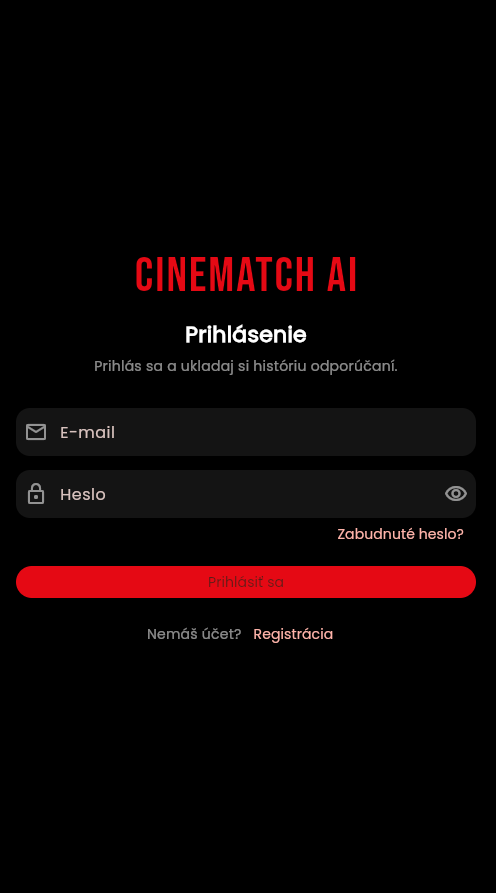
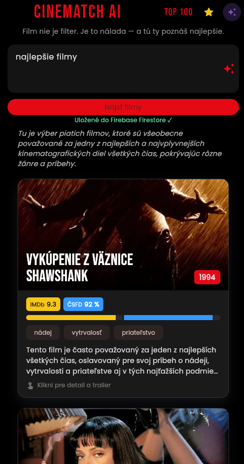
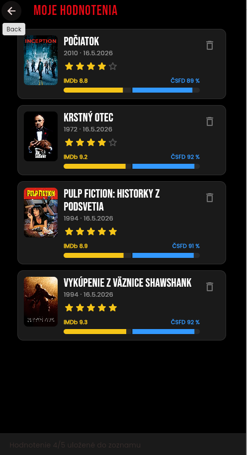
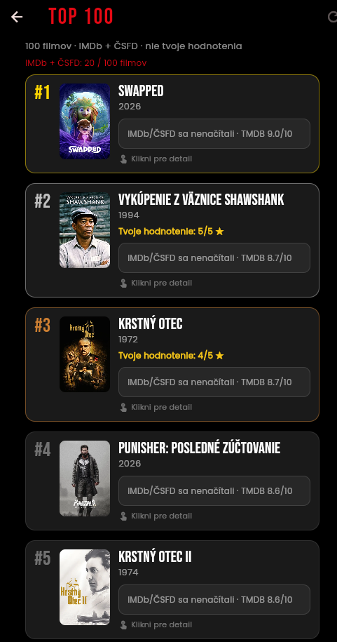
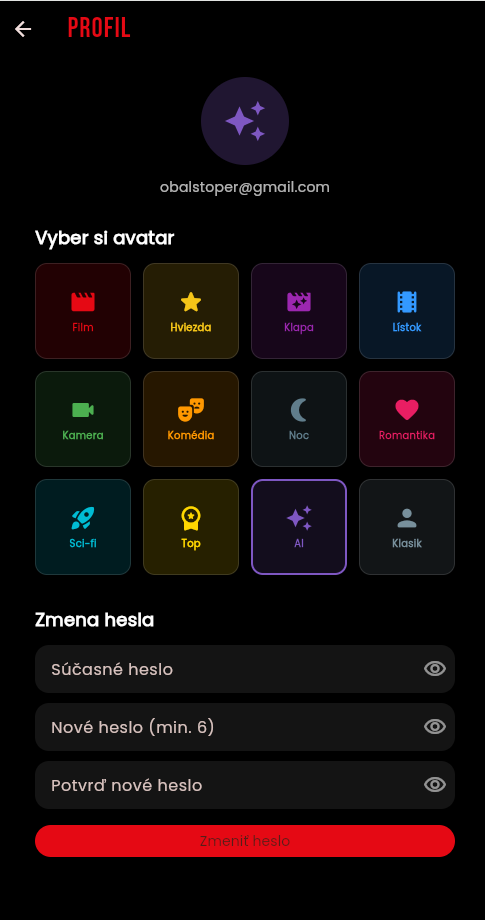

# CineMatch AI

Mobilná / multiplatformová aplikácia na **filmové odporúčania podľa nálady** s integrovaným **Google Gemini** (LLM v runtime) a backendom **Firebase** (Auth + Firestore). Používateľ opíše náladu prirodzeným textom, AI vráti filmy s dôvodmi a náladovou paletou; výsledky sa ukladajú do cloudu. Ďalej: vlastné hodnotenia 1–5 hviezdičiek, globálny **TOP 100** (TMDB + IMDb + ČSFD) a správa profilu.

**Autor:** individuálny projekt (bez tímovej spolupráce).

---

## Splnenie požiadaviek zadania

| Požiadavka | Stav | Poznámka |
|------------|------|----------|
| 1. Funkčné riešenie (frontend + backend) | Splnené | Flutter + Firebase Auth/Firestore + Gemini API |
| 2. Git repozitár, štruktúra, README | Splnené | Viacero commitov počas vývoja, `lib/` podľa vrstiev |
| 3. Tímová spolupráca | Neplatí | Individuálny projekt |
| 4. Využitie LLM | Splnené | Gemini v produkte; vývoj s AI asistentom (Cursor) |
| 5. Technická dokumentácia | Takmer | Tento README; **doplň snímky** do `docs/screenshots/` |
| 6. Reflexia LLM | Splnené | Sekcia nižšie |

---

## Účel projektu

**Prípad použitia:** Používateľ nevie, čo pozerať — napíše náladu alebo situáciu („chcem niečo temné po práci“, „komédia s priateľmi“). Aplikácia:

1. Zavolá **Gemini** a vráti štruktúrovaný zoznam filmov (JSON).
2. Doplní **plagáty** (TMDB / Wikidata / Wikipédia) a **hodnotenia** IMDb (OMDb) a ČSFD.
3. Uloží odporúčanie do **Firestore** (viazané na `userId`).
4. Umožní **hodnotiť filmy** a prehliadať **TOP 100** podľa externých zdrojov.

---

## Technológie a knižnice

| Oblasť | Technológia |
|--------|-------------|
| Frontend | Flutter 3.7+, Material 3, Google Fonts |
| Backend | Firebase Auth, Cloud Firestore |
| LLM (runtime) | Google Gemini (`google_generative_ai`) |
| Externé API | TMDB (plagáty, TOP 100), OMDb (IMDb), scraping ČSFD |
| Ďalšie balíčky | `http`, `cached_network_image`, `url_launcher` |
| Vývojové nástroje | Cursor (AI asistent), Firebase CLI, Git |

---

## Požiadavky na prostredie

- [Flutter SDK](https://docs.flutter.dev/get-started/install) 3.7+
- Účet [Firebase](https://console.firebase.google.com/) — projekt je nakonfigurovaný v `lib/firebase_options.dart`
- [Gemini API kľúč](https://aistudio.google.com/apikey) (povinný pre AI odporúčania)
- Voliteľne pre plnú funkcionalitu:
  - [TMDB API](https://www.themoviedb.org/settings/api) — plagáty, TOP 100
  - [OMDb API](https://www.omdbapi.com/apikey.aspx) — IMDb hodnotenia

---

## Spustenie projektu

```bash
cd flutter_application_1   # koreň repozitára (tento priečinok)
flutter pub get
```

### API kľúče (odporúčané: `--dart-define`, nič do Gitu)

```bash
flutter run -d chrome ^
  --dart-define=GEMINI_API_KEY=TVOJ_GEMINI_KLUC ^
  --dart-define=TMDB_API_KEY=TVOJ_TMDB_KLUC ^
  --dart-define=OMDB_API_KEY=TVOJ_OMDB_KLUC
```

Na Linux/macOS použij `\` namiesto `^`.

Alternatíva pre lokálny vývoj: skopíruj `lib/config/api_secrets.example.dart` → `lib/config/api_secrets.dart` (súbor je v `.gitignore`).

Voliteľný model Gemini:

```bash
--dart-define=GEMINI_MODEL=gemini-2.0-flash-lite
```

### Platformy

```bash
# Web (vhodné na demo)
flutter run -d chrome --dart-define=GEMINI_API_KEY=...

# Android
flutter run -d android --dart-define=GEMINI_API_KEY=...
```

### Firebase backend

1. V [Firebase Console](https://console.firebase.google.com/) zapni **Authentication** (Email/heslo) a **Firestore**.
2. Nasadenie pravidiel (ak máš [Firebase CLI](https://firebase.google.com/docs/cli)):

```bash
firebase deploy --only firestore:rules
```

Súbor `firestore.rules` obmedzuje čítanie/zápis podľa `request.auth.uid` (odporúčania, hodnotenia, profil).

### Rýchly test Gemini (voliteľné)

```bash
dart run tool/test_gemini.dart
```

(spusti s nastaveným kľúčom cez `api_secrets.dart` alebo uprav skript podľa potreby)

---

## Štruktúra repozitára

```
lib/
  config/           # API kľúče (dart-define / api_secrets)
  models/           # Film, hodnotenie, TOP 100, profil
  screens/          # Domov, login, registrácia, TOP 100, hodnotenia, profil
  services/         # Gemini, Firestore, Auth, plagáty, ratingy, TOP 100
  widgets/          # Karty, detail, responzívny layout, hviezdičky
  main.dart
firestore.rules
firestore.indexes.json
firebase.json
docs/screenshots/   # Snímky GUI pre zadanie (doplniť pred odovzdaním)
tool/               # Pomocné skripty (test Gemini, plagáty)
```

---

## Hlavné funkcie (GUI)

| Obrazovka | Popis |
|-----------|--------|
| Prihlásenie / registrácia | Firebase Auth, responzívny layout |
| Domov | Textová náladová požiadavka → Gemini → karty filmov |
| Detail filmu | Sheet: AI dôvod, paleta, trailer, hodnotenie 1–5 ★ |
| Moje hodnotenia | Zoznam vlastných hodnotení z Firestore |
| TOP 100 | Rebríček z TMDB + priemery IMDb/ČSFD |
| Profil | Avatar, zmena hesla |

Na širokých obrazovkách (≥ 900 px) má obsah hlavných obrazoviek **70 % šírky** a je vycentrovaný (`ResponsivePageColumn`). Na telefóne plná šírka s bočným odsadením.

### Snímky obrazovky

Náhľady hlavných obrazoviek aplikácie (tmavý režim, Material 3).

<br>

#### Prihlásenie

<p align="center">
  
</p>

<p align="center"><strong>Prihlásenie</strong> — vstup e-mailom a heslom cez <strong>Firebase Authentication</strong>. Odkaz na registráciu nového účtu.</p>

<br>

#### Domov — AI odporúčania

<p align="center">
  
</p>

<p align="center"><strong>Domov</strong> — používateľ napíše náladu alebo situáciu; <strong>Gemini</strong> vráti filmy s plagátom, tagmi a hodnoteniami IMDb/ČSFD. Výsledok sa uloží do Firestore.</p>

<br>

#### Moje hodnotenia

<p align="center">
  
</p>

<p align="center"><strong>Moje hodnotenia</strong> — prehľad filmov, ktoré používateľ ohodnotil 1–5 hviezdičkami (ukladané v Firestore pod jeho účtom).</p>

<br>

#### TOP 100

<p align="center">
  
</p>

<p align="center"><strong>TOP 100</strong> — globálny rebríček z TMDB doplnený o priemery <strong>IMDb</strong> a <strong>ČSFD</strong>; kliknutím otvoríš detail filmu.</p>

<br>

#### Profil

<p align="center">
  
</p>

<p align="center"><strong>Profil</strong> — výber avatara a zmena hesla prihláseného používateľa.</p>

---

## História Git (výber)

Projekt má **postupné commity** (nie jeden finálny „big bang“), napr.:

- Počiatočné nastavenie Flutter + Firebase
- Plagáty filmov, IMDb/ČSFD
- Prihlásenie / registrácia
- TOP 100, vlastné hodnotenia, profil

Pred odovzdaním over: `git log --oneline` a že repozitár na GitHub/GitLab obsahuje celú históriu.

---

## Reflexia využitia LLM nástrojov

### Ktoré nástroje a kde

| Nástroj | Vývoj | Testovanie | Dokumentácia | Runtime v aplikácii |
|---------|-------|------------|--------------|---------------------|
| **Cursor** (AI v IDE) | Áno — obrazovky, služby, refaktoring, Firestore pravidlá | Čiastočne — návrhy testov | Áno — README, komentáre | Nie |
| **Google Gemini API** | Pomoc pri návrhu promptov | Manuálne cez `tool/test_gemini.dart` | Nie | **Áno** — odporúčania filmov, JSON výstup |

### Prínosy

- **Rýchle prototypovanie UI** (Material 3, tmavý Netflix štýl) bez písania každého widgetu od nuly.
- **Integrácia Firebase a HTTP** — AI navrhlo štruktúru služieb (`GeminiService`, `FirestoreService`, `UserRatingService`).
- **Gemini v produkte** — prirodzený jazyk na vstupe, štruktúrovaný výstup (názvy, roky, dôvody, mood farby) bez vlastného tréningu modelu.
- **Dokumentácia** — konzistentný README a popis spustenia.

### Limity a úskalia

- **Halucinácie** — AI občas navrhne neexistujúci alebo nesprávny film; plagáty a TMDB čiastočne filtrujú realitu, ale nie vždy.
- **API kľúče a kvóty** — Gemini free tier má limity; v kóde je fallback viacerých modelov (`gemini-2.0-flash-lite`, …).
- **ČSFD / scraping** — krehké voči zmenám webu; nie vždy sa nájde hodnotenie.
- **Bezpečnosť** — kľúče len cez `--dart-define` alebo `api_secrets.dart` mimo Gitu; Firestore pravidlá viazané na `uid`, nie verejný zápis.
- **Overovanie AI kódu** — niektoré návrhy bolo treba upraviť (null safety, async `mounted`, layout na webe).

### Čo som sa naučil

- Pracovný postup **„prompt → iterácia → ručná kontrola“** je rýchlejší než čisté písanie, ale **zodpovednosť za architektúru a bugy** zostáva na vývojárovi.
- Pri LLM v produkte je kľúčové **striktne definovať výstup** (JSON schéma v prompte) a mať **fallback** pri chybách modelu.
- Kombinácia **LLM + klasické API** (TMDB, OMDb) dáva lepší UX než samotný text od AI.

*(Odporúča sa doplniť 1–2 screenshoty z Cursoru — prompt + výsledok — do `docs/screenshots/`, napr. `llm-cursor-prompt.png`.)*

---

## Riešenie problémov

| Problém | Riešenie |
|---------|----------|
| Chýba `GEMINI_API_KEY` | Spusti s `--dart-define` alebo `api_secrets.dart` |
| Model Gemini „not found“ | Skús iný model cez `GEMINI_MODEL` alebo nechaj fallback v `GeminiService` |
| TOP 100 nejde načítať | Nastav `TMDB_API_KEY`; prvé načítanie trvá 1–2 min |
| Firebase zápis zlyhá | Zapni Firestore, nasaď `firestore.rules`, prihlás sa |
| Prázdne IMDb hodnotenia | Nastav `OMDB_API_KEY` |

---

## Licencia

Školský projekt — praktický projekt (LLM + Firebase + Flutter).
